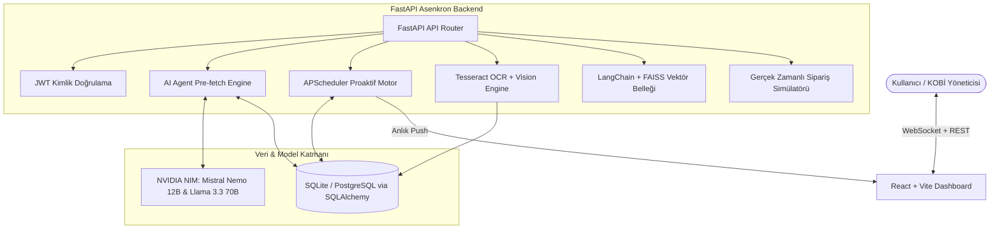

<div align="center">

# 🤖 Nexus AI — KOBİ Operasyon & Finans Asistanı

[](https://github.com/mehmeteminakkaya/Nexus-Proje)
[](https://fastapi.tiangolo.com)
[](https://react.dev)
[](https://build.nvidia.com)
[](LICENSE)

<p align="center">
  <strong>KOBİ'lerin günlük operasyonlarını ve finansal kararlarını otonomlaştıran yapay zekâ asistanı.</strong><br>
  Yönetici Türkçe konuşur; Nexus sorgular, analiz eder, faturaları OCR ile okur ve anında aksiyon alır.
</p>

[Canlı Demo](#-demo) • [Sistem Mimarisi](#%EF%B8%8F-sistem-mimarisi) • [Hızlı Kurulum](#-h%C4%B1zl%C4%B1-kurulum) • [Geliştirici](#-geli%C5%9Ftirici)

---

</div>

## 🎯 Problem & Çözüm

Küçük ve orta ölçekli işletmeler (KOBİ) her gün 2-3 saatini "Hangi sipariş gecikti?", "Kritik stokta ne kaldı?", "Faturadaki ürünleri stoka nasıl işlerim?" gibi operasyonel işlere harcıyor.

**Nexus AI**, tüm bu süreci tek bir doğal dil arayüzüne indirger:

```text
🗣️ "Bugün kaç sipariş var?"         ➔ Anlık sipariş listesi & özet
⚠️ "Kritik stokta ne var?"          ➔ Tükenme riski olan ürünler ve tahmin günü
🔄 "128 nolu siparişi iptal et"     ➔ Veritabanını anında günceller
🧾 [Fatura Görseli Yükle]           ➔ OCR ile satırları okur, stoka otomatik işler
📊 "Bu hafta en çok ne sattık?"     ➔ Anlık analiz, ciro grafiği ve trend raporu
```

---

## 🏗️ Sistem Mimarisi



---

## ✨ Öne Çıkan Özellikler

| Modül | Özellik | Açıklama |
| :--- | :--- | :--- |
| 💬 **AI Operasyon Chat** | Doğal Dil Arayüzü | Sipariş, stok, müşteri sorgularında streaming Türkçe yanıt |
| 📊 **Canlı Dashboard** | Finans & Ciro | Anlık özet: bekleyen siparişler, kritik stoklar, günlük ciro |
| 🔔 **Proaktif AI Motoru** | APScheduler | 5 dakikada bir otomatik stok ve gecikme analizi üretir |
| 🧾 **Otomatik Fatura OCR** | Vision + Tesseract | Fatura görselindeki kalemleri okuyup tek tıkla stoka işler |
| 📈 **Akıllı Stok Tahmini** | Trend Algoritması | Son 30 günlük satış trendine göre tükenme gününü hesaplar |
| ⚡ **Canlı Simülasyon** | Real-time Engine | 90 saniyede bir gerçekçi kargo ve sipariş hareketleri simüle eder |
| 🔐 **Güvenlik & Rol** | JWT Auth | Token tabanlı yönetici ve personel yetkilendirmesi |

---

## 🚀 Hızlı Kurulum

### Ön Koşullar
* Python 3.10+
* Node.js 18+
* [NVIDIA NIM API Key](https://build.nvidia.com/)
* *(Opsiyonel)* Windows için [Tesseract OCR](https://github.com/UB-Mannheim/tesseract/wiki)

### 1. Tek Tıkla Başlatma (Windows)
```cmd
# Depo kökündeki başlatıcıyı çalıştırın:
baslat.bat
```

### 2. Manuel Kurulum Adımları

#### Backend Kurulumu:
```bash
cd backend
python -m venv venv
venv\Scripts\activate      # Windows: venv\Scripts\activate (Mac/Linux: source venv/bin/activate)

pip install -r requirements.txt

cp .env.example .env
# .env dosyasına NVIDIA_API_KEY ve JWT_SECRET değerlerinizi girin

python main.py
# ➔ Backend http://localhost:8000 adresinde ayağa kalkar.
```

#### Frontend Kurulumu:
```bash
cd frontend
npm install
npm run dev
# ➔ Frontend http://localhost:5173 adresinde açılır.
```

#### 🔑 Varsayılan Giriş Bilgileri:
* **Kullanıcı Adı:** `admin`
* **Şifre:** `admin123`
*(İlk açılışta 8 müşteri, 32 ürün ve 100 siparişlik demo verisi otomatik oluşturulur).*

---

## 🛠️ Teknoloji Yığını

* **Backend:** FastAPI, Python 3.11, SQLAlchemy, SQLite, APScheduler, LangChain, FAISS, Tesseract OCR
* **AI & LLM:** NVIDIA NIM API (Mistral-Nemo-12B-Instruct, Llama-3.3-70B-Instruct, NV-EmbedQA-E5)
* **Frontend:** React 18, Vite, Recharts, Tailwind CSS, Native WebSockets
* **DevOps:** Batch scripting, Git, CORS & JWT Security

---

## 👤 Geliştirici & İletişim

**Mehmet Emin Akkaya**  
*İstinye Üniversitesi Bilgisayar Mühendisliği | Google Yapay Zeka ve Teknoloji Akademisi Bursiyeri*

* 🌐 **Portfolyo:** [mehmeteminakkaya.com](https://mehmeteminakkaya.com)
* 💼 **LinkedIn:** [linkedin.com/in/mehmeteminakkaya](https://www.linkedin.com/in/mehmeteminakkaya/)
* 🐙 **GitHub:** [@mehmeteminakkaya](https://github.com/mehmeteminakkaya)
* 📬 **E-Posta:** [aktaha@gmail.com](mailto:aktaha@gmail.com)

---

<div align="center">
  <sub>YZTA 5.0 AI Hackathon Finalist Projesi. Telif Hakkı © 2026.</sub>
</div>
