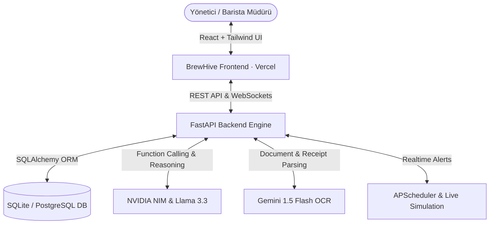

<div align="center">

# ☕ BrewHive AI — Artisan Kahve Zinciri & Akıllı Kafe Operasyon Platformu

[](https://brewhive-ai.vercel.app)
[](https://brewhive-ai.vercel.app)
[](https://brewhive-ai.vercel.app)
[](LICENSE)

<p align="center">
  <strong>İstanbul'daki 3 şubeli (Kadıköy, Beşiktaş, Şişli) ve B2B kurumsal müşterilere sahip bir kahve zincirinin stok, ciro, fatura OCR ve lojistik operasyonlarını otonomlaştıran yeni nesil yapay zekâ platformu.</strong>
</p>

[Canlı Uygulamayı İncele ➔](https://brewhive-ai.vercel.app) • [Geliştirici Portfolyosu ↗](https://mehmeteminakkaya.com) • [LinkedIn](https://www.linkedin.com/in/mehmeteminakkaya/)

---

</div>

## 🌟 BrewHive AI Nedir?

**BrewHive AI**, kafe yöneticilerinin ve barista müdürlerinin karmaşık operasyonel kararlarını hızlandırmak için geliştirilmiş dikey bir **SaaS & AI Co-Pilot** sistemidir.

Klasik gösterge panellerinin aksine BrewHive AI sadece veri listelemez; **doğal dil ile emir alır, toptancı faturalarını görselden okur, şubeler arası stok tükenme sürelerini tahmin eder ve aksiyon alır.**

```text
"Kadıköy şubesinde yulaf sütü stoğu kaç kaldı?"   ➔ Anlık stok + 18 saatlik tükenme uyarısı verir.
"Bugün en çok ciro yapan şubeyi raporla"          ➔ Şube karşılaştırmalı analitik dökümü çıkarır.
"Toptancı kahve faturasını sisteme işle"          ➔ OCR ile çuvalları ayrıştırır, tek tıkla stoğa yansıtır.
```

---

## ✨ Temel Modüller & Fonksiyonlar

| Modül | Açıklama |
| :--- | :--- |
| 📊 **Canlı Şube Dashboard'u** | Kadıköy, Beşiktaş ve Şişli şubelerinin anlık ciro, sipariş ve kritik hammadde göstergeleri. |
| ☕ **Hammadde & Çekirdek Envanteri** | Kahve çekirdeği, süt, şurup ve pastane ürünlerinin şube bazlı stok takibi ve hızlı ekleme/çıkarma. |
| 📦 **Sipariş & Lojistik Akışı** | Masalardan ve B2B kurumsal müşterilerden gelen siparişler, kargo takip numaraları ve durum yönetimi. |
| 🤖 **BrewHive AI Asistan (Co-Pilot)** | Doğal dil ile veritabanı sorgulayan, sesli komut alan ve operasyonel kararları hızlandıran yapay zekâ ajanı. |
| 🧾 **Akıllı Fatura OCR Tarayıcısı** | Toptancıdan gelen kahve ve süt faturalarını Gemini OCR ile okuyup otomatik stoğa aktarma. |
| 🔮 **Talep & Stok Tahmin Motoru** | Tüketim hızına göre stok bitiş gününü (Runout Days) hesaplayan ve otomatik tedarik öneren algoritma. |

---

## 🏗️ Mimari & Veri Akışı



---

## 🚀 Hızlı Başlangıç & Yerel Kurulum

### 1. Web Uygulamasını Başlatma (Frontend):
```bash
cd frontend
npm install
npm run dev
# ➔ http://localhost:5173 adresinde açılır
```

### 2. Backend Servisini Başlatma (Python):
```bash
cd backend
python -m venv venv
venv\Scripts\activate # Mac/Linux: source venv/bin/activate
pip install -r requirements.txt
python main.py
# ➔ API http://localhost:8000 adresinde ayağa kalkar
```

---

## 👨‍💻 Geliştirici & İletişim

**Mehmet Emin Akkaya**  
*İstinye Üniversitesi Bilgisayar Mühendisliği | Google Yapay Zeka Akademisi Bursiyeri*

* 🌐 **Portfolyo:** [mehmeteminakkaya.com](https://mehmeteminakkaya.com)
* 💼 **LinkedIn:** [linkedin.com/in/mehmeteminakkaya](https://www.linkedin.com/in/mehmeteminakkaya/)
* 🐙 **GitHub:** [@mehmeteminakkaya](https://github.com/mehmeteminakkaya)
* 📬 **E-Posta:** [mehmeteminakkaya12@gmail.com](mailto:mehmeteminakkaya12@gmail.com)

---

<div align="center">
  <sub>Telif Hakkı © 2026 Mehmet Emin Akkaya · BrewHive AI. Tüm hakları saklıdır.</sub>
</div>
